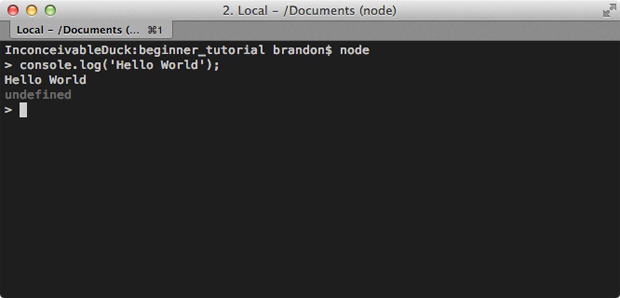
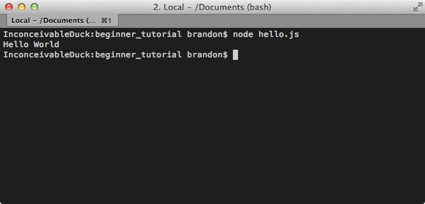
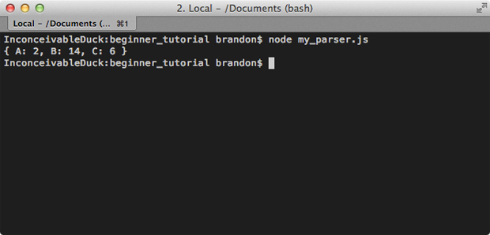

There's no shortage of Node.js tutorials out there, but most of them cover
specific use cases or topics that only apply when you've already got Node up
and running. I see comments every once and awhile that sound something like,
"I've downloaded Node, now what?". This tutorial answers that question and
explains how to get started from the very beginning.

# What is Node.js?

A lot of the confusion for newcomers to Node is misunderstanding exactly what
it is. The description on [nodejs.org][nodejs] definitely doesn't help.

An important thing to realize is that Node is not a webserver. By itself it
doesn't do anything. It doesn't work like Apache. There is no config file
where you point it to you HTML files. If you want it to be a HTTP server, you
have to write an HTTP server (with the help of its built-in libraries).
Node.js is just another way to execute code on your computer. It is simply a
JavaScript runtime.

# Installing Node

Node.js is very easy to install. If you're using Windows or Mac, installers
are available on the [download page][download].

# I've Installed Node, now what?

Once installed you'll have access to a new command called `node`. You can use
the `node` command in two different ways. The first is with no arguments. This
will open an interactive shell (REPL: read-eval-print-loop) where you can
execute raw JavaScript code.

    $ node
    > console.log('Hello World');
    Hello World
    undefined

In the above example I typed `console.log('Hello World')` into the shell and
hit enter. Node will then execute that code and we can see our logged message.
It also prints `undefined` because it displays the return value of each
command and console.log doesn't return anything.

The other way to run Node is by providing it a JavaScript file to execute.
This is almost always how you'll be using it.

*hello.js*

    console.log('Hello World');

<!--  -->

    $ node hello.js
    Hello World

In this example, I moved the `console.log` message into a file then passed
that file to the `node` command as an argument. Node then runs the JavaScript
in that file and prints `Hello World`.

## Doing Something Useful - File I/O

Running plain JavaScript is fun and all, but not very useful. This is why
Node.js also includes a powerful set of [libraries][lib] (modules) for doing
real things. In this first example I'm going to open a log file and parse it.

*example_log.txt*

    2013-08-09T13:50:33.166Z A 2
    2013-08-09T13:51:33.166Z B 1
    2013-08-09T13:52:33.166Z C 6
    2013-08-09T13:53:33.166Z B 8
    2013-08-09T13:54:33.166Z B 5

What this log data means is not important, but basically each message contains
a date, a letter, and a value. I want to add up the values for each letter.

The first thing we need to do it read the contents of the file.

*my_parser.js*

    // Load the fs (filesystem) module
    var fs = require('fs');

    // Read the contents of the file into memory.
    fs.readFile('example_log.txt', function (err, logData) {

      // If an error occurred, throwing it will
      // display the exception and end our app.
      if (err) throw err;

      // logData is a Buffer, convert to string.
      var text = logData.toString();
    });

Fortunately Node.js makes file I/O really easy with the built-in
[filesystem][fs] (`fs`) module. The `fs` module has a function named
[readFile][readFile] that takes a file path and a callback. The callback will
be invoked when the file is done being read. The file data comes in the form
of a [Buffer][buffer], which is basically a byte array. We can convert it to a
string using the [toString][toString]() function.

Now let's add in the parsing. This is pretty much normal JavaScript so I won't
go into any details.

*my_parser.js*

    // Load the fs (filesystem) module.
    var fs = require('fs');

    // Read the contents of the file into memory.
    fs.readFile('example_log.txt', function (err, logData) {

      // If an error occurred, throwing it will
      // display the exception and kill our app.
      if (err) throw err;

      // logData is a Buffer, convert to string.
      var text = logData.toString();

      var results = {};

      // Break up the file into lines.
      var lines = text.split('\n');

      lines.forEach(function(line) {
        var parts = line.split(' ');
        var letter = parts[1];
        var count = parseInt(parts[2]);

        if(!results[letter]) {
          results[letter] = 0;
        }

        results[letter] += parseInt(count);
      });

      console.log(results);
      // { A: 2, B: 14, C: 6 }
    });

Now when you pass this file as the argument to the `node` command it will
print the result and exit.

    $ node my_parser.js
    { A: 2, B: 14, C: 6 }

I use Node.js a lot for scripting like this. It's much easier and a more
powerful alternative to bash scripts.

# Asynchronous Callbacks

As you saw in the previous example, the typical pattern in Node.js is to use
asynchronous callbacks. Basically you're telling it to do something and when
it's done it will call your function (callback). This is because Node is
single-threaded. While you're waiting on the callback to fire, Node can go off
and do other things instead of blocking until the request is finished.

This is especially important for web servers. It's pretty common in modern web
applications to access a databases. While you're waiting for the database to
return results Node can process more requests. This allows you to handle
thousands of concurrent connections with very little overhead, compared to
creating a separate thread for each connection.

# Doing Something Useful - HTTP Server

Like I said before Node doesn't do anything out of the box. One of the built-
in modules makes it pretty easy to create a basic [HTTP server][http], which
is the example on the [Node.js][nodejs] homepage.

*my_web_server.js*

    var http = require('http');

    http.createServer(function (req, res) {
      res.writeHead(200, {'Content-Type': 'text/plain'});
      res.end('Hello World\n');
    }).listen(8080);

    console.log('Server running on port 8080.');

When I say basic, I mean basic. This is not a full-featured HTTP server. It
can't serve any HTML file or images. In fact, no matter what you request, it
will return `Hello World`. However, you can run this and hit
[http://localhost:8080](http://localhost:8080) in your browser and you'll see
the text.

    $ node my_web_server.js

You might notice something a little different now. Your Node.js application no
longer exits. This is because you created a server and your Node.js
application will continue to run and respond to requests until you kill it
yourself.

If you want this to be a full-featured web server, then you have to do that
work. You have to check what was requested, read the appropriate files, and
send the content back. There's good news, though. People have already done
this hard work for you.

# Doing Something Useful - Express

[Express][express] is a framework that makes creating most normal websites
very simple. The first thing you have to do it install it. Along with the
`node` command you also have access to a command called `npm`. This tool gives
you access to an enormous collection of modules created by the community, and
one of them is Express.

    $ cd /my/app/location
    $ npm install express

When you install a module, it will put it in a `node_modules` folder inside
your application directory. You can now require it like any built-in module.
Let's create a basic static file server using Express.

*my_static_file_server.js*

    var express = require('express'),
        app = express();

    app.use(express.static(__dirname + '/public'));

    app.listen(8080);

<!--  -->

    $ node my_static_file_server.js

You now have a pretty capable static file server. Anything you put in the
`/public` folder can now be requested by your browser and displayed. HTML,
images, almost anything. So for example, if you put an image called
`my_image.png` inside the public folder, you can access it using your browser
by going to
[http://localhost:8080/my_image.png](http://localhost:8080/my_image.png). Of
course Express has many many more features, but you can look those up as you
continue developing.

# NPM

We touched on [npm][npmjs] a little in the previous section, but I want to
emphasize how important this tool will be to normal Node.js development. There
are thousands of modules available that solve almost all typical problems that
you're likely to encounter. Remember to check npm before re-inventing the
wheel. It's not unheard of for a typical Node.js application to have dozens of
dependencies.

In the previous example we manually installed Express. If you have a lot of
dependencies, that's not going to be a very good way to install them. That's
why npm makes use of a `package.json` file.

*package.json*

    {
      "name" : "MyStaticServer",
      "version" : "0.0.1",
      "dependencies" : {
        "express" : "3.3.x"
      }
    }

A [package.json][package-json] file contains an overview of your application.
There are a lot of available fields, but this is pretty much the minimum. The
dependencies section describes the name and version of the modules you'd like
to install. In this case I'll accept any version of Express 3.3. You can list
as many dependencies as you want in this section.

Now instead of installing each dependency separately, we can run a single
command and install all of them.

    $ npm install

When you run this command npm will look in the current folder for a
package.json file. If it finds one, it will install every dependency listed.

# Code Organization

So far we've only been using a single file, which isn't very maintainable. In
most applications your code will be split into several files. There's no
standard or enforced organization to what files go where. This isn't Rails.
There's no concept of views go here and controllers go there. You can do
whatever you want.

Let's re-factor the log parsing script. It's much more testable and more
maintainable if we separate out the parsing logic into its own file.

*parser.js*

    // Parser constructor.
    var Parser = function() {

    };

    // Parses the specified text.
    Parser.prototype.parse = function(text) {

      var results = {};

      // Break up the file into lines.
      var lines = text.split('\n');

      lines.forEach(function(line) {
        var parts = line.split(' ');
        var letter = parts[1];
        var count = parseInt(parts[2]);

        if(!results[letter]) {
          results[letter] = 0;
        }

        results[letter] += parseInt(count);
      });

      return results;
    };

    // Export the Parser constructor from this module.
    module.exports = Parser;

What I did was create a new file to hold the logic for parsing logs. This is
just standard JavaScript and there are many ways to encapsulate this code. I
chose to define a new JavaScript object because it's easy to unit test.

The important piece to this is the `module.exports` line. This tells Node what
you're exporting from this file. In this case I'm exporting the constructor,
so users can create instances of my `Parser` object. You can export whatever
you want.

Now let's look at how to import this file and make use of my new `Parser`
object.

*my_parser.js*

    // Require my new parser.js file.
    var Parser = require('./parser');

    // Load the fs (filesystem) module.
    var fs = require('fs');

    // Read the contents of the file into memory.
    fs.readFile('example_log.txt', function (err, logData) {

      // If an error occurred, throwing it will
      // display the exception and kill our app.
      if (err) throw err;

      // logData is a Buffer, convert to string.
      var text = logData.toString();

      // Create an instance of the Parser object.
      var parser = new Parser();

      // Call the parse function.
      console.log(parser.parse(text));
      // { A: 2, B: 14, C: 6 }
    });

Files are included exactly like modules, except you provide a path instead of
a name. The `.js` extension is implied so you can leave it off if you want.

Since I exported the constructor that is what will be returned from the
require statement. I can now create instances of my Parser object and use it.

# Summary

Hopefully this tutorial can bridge the gap between downloading
[Node.js][nodejs] and building your first widget. Node.js is an extremely
powerful and flexible technology that can solve a wide variety of problems.

I want everyone to remember that Node.js is only bound by your imagination.
The core libraries are very carefully designed to provide the puzzle pieces
needed to build any picture. Combine those with the modules available in npm
and it's amazing how quickly you can begin building very complex and
compelling applications.

[nodejs]: http://nodejs.org
[download]: http://nodejs.org/download
[lib]: http://nodejs.org/api/
[fs]: http://nodejs.org/api/fs.html
[readFile]: http://nodejs.org/api/fs.html#fs_fs_readfile_filename_options_callback
[buffer]: http://nodejs.org/api/buffer.html
[toString]: http://nodejs.org/api/buffer.html#buffer_buf_tostring_encoding_start_end
[http]: http://nodejs.org/api/http.html#http_http_createserver_requestlistener
[express]: http://expressjs.com/
[npmjs]: https://npmjs.org/
[package-json]: https://npmjs.org/doc/files/package.json.html
