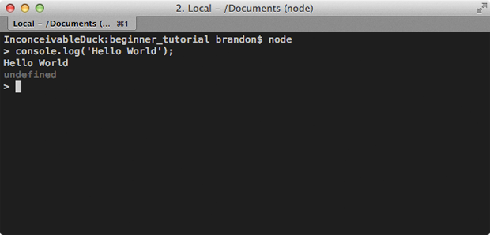
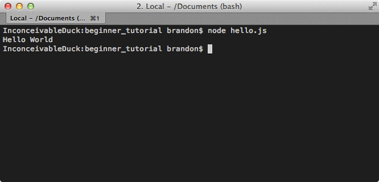

Сейчас нет недостатка в обучающих материалах по Node.js, но большинство 
из них охватывают либо какие-то конкретные варианты использования либо темы, 
применимые уже тогда, когда у вас есть работающий Node.js То тут, то там я 
вижу комментарии вроде «я скачал Node.js, что теперь?». Это пособие ответит 
на этот вопрос и объяснит, как начать с самого начала.

# Что есть Node.js?

Много путаницы у новичков в Node.js возникает из-за непонимания того, что 
же на самом деле это такое. Описание на [nodejs.org][nodejs] совершенно не 
помогает разобраться.

Важно понять, что Node — это не веб-сервер. Сам по себе он ничего не 
делает. Он не работает как Apache. Там нет конфиг-файла, в котором 
указывается путь до HTML-файлов. Если вам нужен HTTP-сервер, вам нужно 
написать HTTP-сервер (с помощью встроенных библиотек). Node.js — это 
просто ещё один способ выполнять код на вашем компьютере. Это просто среда 
выполнения JavaScript.

# Установка Node

Node.js очень просто установить. Если вы используете Windows или Mac, 
установочные файлы доступны на [странице загрузки][download].

# Я установил Node, что теперь?

Сразу после установки вам становится доступна новая команда `node`. Её можно 
использовать двумя разными способами. Первый способ — без аргументов. 
Откроется интерактивная оболочка (REPL: read-eval-print-loop), где вы можете 
выполнять обычный JavaScript-код.

    $ node
    > console.log('Hello World');
    Hello World
    undefined

В примере выше я написал `console.log('Hello World')` в оболочке и нажал 
Enter. Node.js выполнит этот код, и мы сможем увидеть наше сообщение. Также 
выводится `undefined`, потому что оболочка отображает возвращаемое значение 
каждой команды, а `console.log` ничего не возвращает.

Другой способ использования Node состоит в предоставлении ему 
JavaScript-файла для выполнения. Так вы будете делать практически всегда.

*hello.js*

    console.log('Hello World');

Теперь запустим его в терминале:

    $ node hello.js
    Hello World

В этом примере я переместил `console.log` в файл, который затем передал 
команде `node` в качестве аргумента. Node затем запускает JavaScript из 
этого файла и выводит `Hello World`.

## Делаем что-нибудь полезное — работа с файлами

Просто выполнять JavaScript весело и всё такое, но не очень полезно. Вот 
почему Node.js также включает в себя мощный набор 
[библиотек][lib] (модулей) для серьёзных задач. В этом первом примере я 
собираюсь открыть файл с логами и распарсить его.

*example_log.txt*

    2013-08-09T13:50:33.166Z A 2
    2013-08-09T13:51:33.166Z B 1
    2013-08-09T13:52:33.166Z C 6
    2013-08-09T13:53:33.166Z B 8
    2013-08-09T13:54:33.166Z B 5

Неважно, что означают данные в логах, но по существу каждое сообщение 
содержит дату, букву и значение. Допустим, я хочу просуммировать значения 
для каждой буквы.

Сперва нам нужно считать содержимое файла.

*my_parser.js*

    // Загрузка модуля fs (файловая система)
    var fs = require('fs');

    // Считывание содержимого файла в память
    fs.readFile('example_log.txt', function (err, logData) {

      // Если произошла ошибка, то при её выбросе отобразится исключение,
      // и работа приложения завершится
      if (err) throw err;

      // logData имеет тип Buffer, переводим в string
      var text = logData.toString();
    });

К счастью, Node.js делает работу с файлами очень простой благодаря 
встроенному модулю [файловой системы][fs] (`fs`). Модуль `fs` содержит 
функцию [readFile][readFile], принимающую путь до файла и коллбэк. Коллбэк 
вызовется, когда завершится чтение файла. Данные из файла поступают в виде 
объекта типа [Buffer][buffer], по сути представляющего собой массив байтов. 
Мы можем перевести его в строку с помощью функции [toString][toString]().

Теперь давайте займёмся парсингом. Это вполне себе обычный JavaScript, 
поэтому я не буду вдаваться в детали.

*my_parser.js*

    // Загрузка модуля fs
    var fs = require('fs');

    // Считывание содержимого файла в память
    fs.readFile('example_log.txt', function (err, logData) {

      // Если произошла ошибка, то при её выбросе отобразится исключение,
      // и работа приложения завершится.
      if (err) throw err;

      // logData имеет тип Buffer, переводим в строку
      var text = logData.toString();

      var results = {};

      // Разбивка файла по строкам
      var lines = text.split('\n');

      lines.forEach(function(line) {
        var parts = line.split(' ');
        var letter = parts[1];
        var count = parseInt(parts[2]);

        if(!results[letter]) {
          results[letter] = 0;
        }

        results[letter] += parseInt(count);
      });

      console.log(results);
      // { A: 2, B: 14, C: 6 }
    });

Теперь, когда вы передадите этот файл команде `node` в качестве аргумента, 
она выведет результат и завершит работу.

    $ node my_parser.js
    { A: 2, B: 14, C: 6 }

Я часто использую Node.js для написания таких скриптов. Это намного 
более простая и мощная альтернатива bash-скриптам.

# Асинхронные коллбэки

Как вы могли видеть в предыдущем примере, типичным шаблоном в Node.js 
является использование асинхронных коллбэков. По сути вы говорите ему что-то 
сделать, и когда оно будет готово, вызвать вашу функцию (коллбэк). Всё 
потому, что Node.js однопоточный. Пока вы ждёте вызова коллбэка, Node.js 
может отвлечься и заняться другими делами, а не блокировать поток в ожидании 
завершения обработки запроса.

Это особенно важно для веб-серверов. Доступ к базам данных в современных 
веб-приложениях — обычное дело. Пока вы ждёте ответа от базы, Node.js может 
обработать ещё запросы. Это позволяет вам обрабатывать тысячи одновременных 
соединений с очень маленькими затратами, сравнимыми с созданием отдельного 
потока для каждого соединения.

# Делаем что-нибудь полезное — HTTP-сервер

Как я уже говорил ранее, Node.js не делает ничего «из коробки». Один из 
встроенных модулей позволяет без особых усилий создать простой 
[HTTP-сервер][http], указанный в примере на сайте [Node.js][nodejs].

*my_web_server.js*

    var http = require('http');

    http.createServer(function (req, res) {
      res.writeHead(200, {'Content-Type': 'text/plain'});
      res.end('Hello World\n');
    }).listen(8080);

    console.log('Server running on port 8080.');

Когда я говорю, «простой», это значит «простой». Это не навороченный 
HTTP-сервер. Он не работает с HTML или изображениями. Фактически, что бы вы 
ни запросили, он вернёт `Hello World`. Тем не менее, можете запустить его, 
зайти на [http://localhost:8080](http://localhost:8080) в вашем браузере и 
увидеть этот текст.

    $ node my_web_server.js

Возможно, вы заметите небольшую разницу: ваше приложение не завершает 
работу. Так происходит потому, что вы создали сервер, и теперь он будет 
продолжать работать и отвечать на запросы до тех пор, пока вы не убьёте его 
сами.

Если вы хотите превратить это приложение в полноценный веб-сервер, тогда вам 
нужно потрудиться. Вам нужно будет проверять, что запрошено, читать 
соответствующие файлы и отсылать назад контент. Впрочем, есть и хорошая 
новость: другие уже сделали эту тяжкую работу за вас.

# Делаем что-нибудь полезное — Express

[Express][express] — это фреймворк, делающий создание большинства сайтов 
очень простым. Первое, что вам нужно будет сделать — установить его. Вместе 
с командой `node` у вас также есть доступ к команде с именем `npm`. Этот 
инструмент даёт вам доступ к колоссальному скоплению модулей, созданных 
сообществом, и Express как раз один из них.

    $ cd /my/app/location
    $ npm install express

Установленный модуль расположится в папке `node_modules` внутри каталога с 
вашим приложением. Оттуда вы сможете подключать его так же, как любой 
встроенный модуль. Давайте создадим с помощью Express простой сервер, 
отдающий статику.

*my_static_file_server.js*

    var express = require('express'),
        app = express();

    app.use(express.static(__dirname + '/public'));

    app.listen(8080);

<!--  -->

    $ node my_static_file_server.js

Теперь у вас есть довольно мощный сервер для статического контента. Всё, что 
вы сложите в папку `/public`, может быть запрошено из браузера и отображено. 
HTML, изображения, почти всё, что душе угодно. Например, если вы положите 
изображение с именем `my_image.png` в эту папку, его можно будет запросить, 
зайдя в браузере на 
[http://localhost:8080/my_image.png](http://localhost:8080/my_image.png). 
Разумеется, у Express намного больше возможностей, но их вы можете открыть 
для себя, продолжив изучение самостоятельно.

# NPM

Мы уже немного ознакомились с [npm][npmjs] в предыдущем разделе, но я хотел 
бы подчеркнуть важность этого инструмента в контексте разработки на 
Node.js. Вам доступны тысячи модулей, решающих практически все типичные 
проблемы, с которыми вы, возможно, столкнётесь. Не забывайте проверять 
npm перед тем, как изобретать велосипед. Иметь кучу зависимостей 
нормально для типичного приложения на Node.js.

В предыдущем примере мы установили Express вручную. Если у вашего проекта 
много зависимостей, то устанавливать их таким образом не очень хорошо, 
поэтому npm использует файлы `package.json`.

*package.json*

    {
      "name" : "MyStaticServer",
      "version" : "0.0.1",
      "dependencies" : {
        "express" : "3.3.x"
      }
    }

Файл [package.json][package-json] содержит общие сведения о вашем приложении.
Для него доступно множество полей, но это необходимый минимум. Секция 
`dependencies` описывает имя и версию модулей, которые вы хотите установить. 
В данном случае мне подойдёт любая версия Express 3.3. Вы можете перечислить 
в этой секции столько зависимостей, сколько захотите.

Теперь вместо установки зависимостей по одной мы можем установить все одной 
командой.

    $ npm install

При запуске этой команды npm будет искать *package.json* в текущей 
директории, и если найдёт, то установит каждую указанную в нём зависимость.

# Организация кода

Итак, до этого момента мы работали только с одним файлом, что не очень хорошо 
с точки зрения поддержки кода. В большинстве приложений вы будете 
распределять код между несколькими файлами. На данный момент какого-либо 
стандарта или рекомендуемой структуры файлов не существует. Это не Rails. 
Здесь нет концепта «представления идут сюда, а контроллеры — сюда». Можете 
делать так, как захотите.

Давайте отрефакторим скрипт для парсинга логов. Его будет легче поддерживать 
и тестировать, если мы выделим логику парсера в отдельный файл.

*parser.js*

    // Конструктор парсера
    var Parser = function() {

    };

    // Парсит переданный текст
    Parser.prototype.parse = function(text) {

      var results = {};

      // Разбивает текст на строки
      var lines = text.split('\n');

      lines.forEach(function(line) {
        var parts = line.split(' ');
        var letter = parts[1];
        var count = parseInt(parts[2]);

        if(!results[letter]) {
          results[letter] = 0;
        }

        results[letter] += parseInt(count);
      });

      return results;
    };

    // Выносит конструктор парсера в модуль
    module.exports = Parser;

Я создал новый файл, содержащий логику для парсинга. Это просто JavaScript, 
и существует множество способов инкапсуляции этого кода. Я предпочитаю 
заводить новый объект, потому что так легче проводить юнит-тестирование.

Важная часть в этом коде — строка с `module.exports`. Она объясняет Node.js, 
что вы выносите из этого файла. В данном случае я выношу конструктор, чтобы 
пользователи могли создавать экземпляры моего объекта `Parser`. Вы сможете 
выносить то, что сами захотите.

Давайте теперь посмотрим, как импортировать этот файл и использовать новый 
объект `Parser`.

*my_parser.js*

    // Подключение нового файла parser.js
    var Parser = require('./parser');

    // Загрузка модуля fs
    var fs = require('fs');

    // Считывание содержимого файла в память
    fs.readFile('example_log.txt', function (err, logData) {

      // Если произошла ошибка, то при её выбросе отобразится исключение,
      // и работа приложения завершится.
      if (err) throw err;

      // logData имеет тип Buffer, переводим в строку
      var text = logData.toString();

      // Создаём экземпляр Parser
      var parser = new Parser();

      // вызываем функцию парсинга
      console.log(parser.parse(text));
      // { A: 2, B: 14, C: 6 }
    });

Файлы подключается точно так же, как и модули, за исключением того, что 
вместо имени модуля нужно писать путь. Расширение `.js` подразумевается по 
умолчанию, так что можете опустить его, если хотите.

Так как я вынес в модуль конструктор, то он и вернётся выражением `require`. 
Теперь я могу создавать экземпляры `Parser` и использовать их.

# Итог

Надеюсь, это пособие поможет заполнить пробел между скачиванием 
[Node.js][nodejs] и разработкой вашего первого маленького приложения. 
Node.js — это чрезвычайно мощная и гибкая технология для широкого спектра 
задач.

Я хочу, чтобы вы запомнили, что в Node.js всё зависит исключительно от 
вашего воображения. Встроенные библиотеки тщательно продуманы, чтобы 
вписываться в любую картину. Используйте их бок о бок с модулями, доступными 
в npm, и вы удивитесь, как быстро сможете разрабатывать очень сложные и 
послушные приложения.

[nodejs]: http://nodejs.org
[download]: http://nodejs.org/download
[lib]: http://nodejs.org/api/
[fs]: http://nodejs.org/api/fs.html
[readFile]: http://nodejs.org/api/fs.html#fs_fs_readfile_filename_options_callback
[buffer]: http://nodejs.org/api/buffer.html
[toString]: http://nodejs.org/api/buffer.html#buffer_buf_tostring_encoding_start_end
[http]: http://nodejs.org/api/http.html#http_http_createserver_requestlistener
[express]: http://expressjs.com/
[npmjs]: https://npmjs.org/
[package-json]: https://npmjs.org/doc/files/package.json.html
